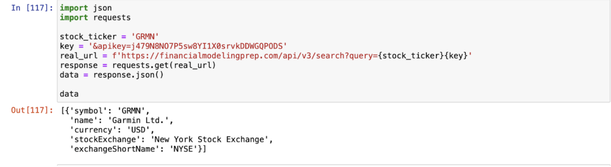

# Phase 1 CS 4973 Group 4

## Project Description

For our project, we chose to analyze stocks bought in large quantities by main politicians. This project could potentially lead users to great investments, but also bring them to the awareness of how some things in our government system are broken. We believe that through this project, we can not only help people in their personal financing, but also have the prospect of changing legislation in the future, to make insider trading for politicians more regulated. The model will follow the public data of what stocks have been bought by politicians, and the price before the purchase, and the price after the purchase, a few weeks or a month later. We will collect this data, in a quote from the api, giving the metric of how the stock has been performing after the purchase, and then make a prediction using the ML skills taught in class. This would inform users where the stock price is going, and the specific stock is first flagged after the purchase of a politician. There will also be a feature where we have an analysis on if the stock is a strong buy, buy, neutral, sell, or strong sell for the users to gain more opinion on the stock. The reason why we decided to explore this topic was because to shield more light on potential political corruption and advocate for greater transparency and accountability in world government.

# User Stories
## Persona 1: John
John Taylor is a 28-year-old marketing specialist living in Chicago, Illinois, with a keen interest in growing his wealth through investments. Although he has a basic understanding of stock investments, he lacks the expertise for in-depth analysis. Eager to diversify and expand his portfolio, John seeks a user-friendly website that provides real-time information on stocks bought by politicians, allowing him to "buy low" as politicians often do. He prefers simple figures and predictive models to guide his investment decisions and plans to track the growth of these investments in the web app's personal tracker to measure the accuracy of the model. John's motivation is driven by his desire for clear financial data, timely updates, and opportunities to make quick, informed investment decisions.

## User Stories for Persona 1: John
- As a data-driven individual, I want access to historical data on politicians' stock performance so that I can identify trends and patterns to inform my investments.
- As a novice investor, I want real-time updates on stocks bought by politicians so that I can make timely investment decisions.
- As a Chicago-based investor, I want notifications for new politician stock purchases so that I can act promptly to "buy low."
- As a proactive investor, I want the ability to share information about stocks bought by politicians with my friends so that we can discuss and make informed investment decisions together.

## Persona 2: Caroline
Caroline is a 40 year old politician campaign manager, and she is part of a team to ruin the reputation of their team’s competition. She can use this data to see how successful they have been at investing, and then see if there is potential for insider trading to be talked about. Visualizations created by the website will be important to her so she can easily publicize the information to the public, to show when the trade was placed/sold in comparison to the legislation made in the Senate. After she shares this data to the public in various ways, she would track her progress made against the opponent. This progress would be the approval ratings, projected votes, and public opinion changes of the politician that she was trying to dismantle.

Caroline has a robust background in political science and communications, with over 15 years of experience managing high-profile campaigns. She is known for her strategic use of data to influence public perception and is motivated by a strong sense of ethics and professional success. Caroline believes that holding politicians accountable is crucial for a fair political landscape. 

## User Stories for Persona 2: Caroline
- I want to expose the potential conflicts of interest in my opponent’s financial activities, so I can strengthen my candidate’s campaign by highlighting their ethical shortcomings.
- I want to access detailed reports on stock trades made by the opponent.
- I want to track the impact of my revelations on public opinion and approval ratings, so I can measure the effectiveness of my campaign strategies.
- I want to create compelling visualizations of the stock trades and their correlation with legislation, so I can easily share this information with the public and the media.

## Persona 3: Bobby

Bobby is a 24 year-old investigative journalist who works for a major news outlet.
He is dedicated to uncovering government misconduct and holding the politicians accountable. He may want to look into the projection to see if the stock randomly got legislation passed, and somehow a company that was not projected well, surged and the politicians were able to receive a profit. These can be tell-tale signs that there was insider trading and illegal investing from the person in question. He can use this data and the models that are placed in the website to show how corrupt the politicians are. This will be published into his article, he will track the views and the reactions of his work. 

## User Stories for Persona 3: Bobby
- As an investigative journalist, I want to see the data behind the stock trade placed by a certain politician, so I can see how much they bought and when they placed it.
- As an investigative journalist, I want to compare stock performance before and after certain legislation is passed so that I can detect unusual stock surges that may indicate illegal trading.
- As an investigative journalist, I want to include detailed findings and visual evidence in my published articles so that readers can understand the extent of the corruption.

## Data Source

Our group was able to find an API that provided all of the necessary data that we need in order to do our project. This API involves a key in order to gain a connection, which only requires registering for an accoun (only takes <2 minutes to do) 

[API link for stock](https://site.financialmodelingprep.com/developer/docs) 

[Legislation API 1](https://legiscan.com/legiscan)

[Legislation API 2](https://www.propublica.org/datastore/apis)

## Major Questions we want Answered

- Are there certain politicians whose stock picks consistently outperform the market?

This question is interesting because it can suggest whether some politicians use any insider knowledge to give them an advantage in stock trading.

- Which stocks bought by politicians have shown significant gains after their purchase?

This question is interesting because it can be used for investors, who can use it for their own investment strategies and can show potential market influence of political decisions on the stock market.

- What are the short-term and long-term effects on stock prices after being bought by politicians?

This question is interesting because the analysis can reveal whether the initial price increases are temporary or long-term. It means that it helps assess whether these investments are based on fundamentals ideas or purely speculative advantages.

-What type of legislation is related to stock purchases

This question will help us understand the correlation between legislation being passed and insider trading, if any.
